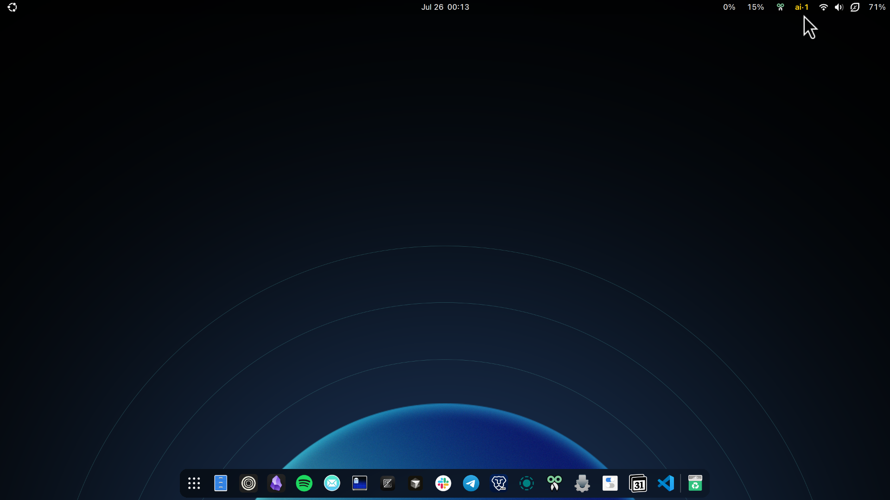
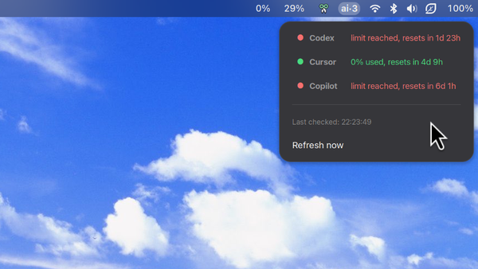

<p align="center">
  <h1 align="center">Freeby</h1>
  <p align="center">Track your free-tier AI coding tool usage at a glance.</p>
</p>

<p align="center">
  
  
</p>

<p align="center">
  <a href="#features">Features</a> ·
  <a href="#supported-providers">Providers</a> ·
  <a href="#install">Install</a> ·
  <a href="#settings">Settings</a> ·
  <a href="#contributing">Contributing</a> ·
  <a href="https://github.com/kcnewman/freeby/releases">Releases</a>
</p>

---

### Features

| | Feature | Description |
|---|---|---|
|  | **Panel indicator** | Colored `ai·N` shows available providers at a glance |
| | **Dropdown** | Per-provider usage, limits, and reset countdown |
| | **Notifications** | Desktop alert when a provider hits its limit |
| | **Auto-refresh on wake** | Refreshes immediately after sleep |
| | **Parallel fetches** | All providers queried in parallel (~2s) |
| | **Configurable** | Adjust refresh interval and notifications in settings |
| | **Accessible** | Screen reader support for all UI elements |
| | **Theme-aware** | Works with light and dark GNOME themes |

---

### Supported providers

| | Provider | Auth source | Data source |
|---|---|---|---|
|  | **Codex** | `~/.codex/auth.json` | `codex-check` CLI |
|  | **Cursor** | `~/.config/cursor/auth.json` | Cursor API |
|  | **Copilot** | `gh` CLI or `~/.config/freeby/copilot-token` | GitHub API |

---

### Install

**Prerequisites**

- GNOME Shell 45+ (Wayland or X11)
- `python3`, `curl`, `meson`, `ninja-build`
- `npx` (for Codex)
- `gh` CLI (for Copilot, optional)

<details>
<summary>Fedora</summary>

```bash
sudo dnf install meson ninja-build python3 curl glib2-devel
```
</details>

<details>
<summary>Ubuntu / Debian</summary>

```bash
sudo apt install meson ninja-build python3 curl libglib2.0-dev-bin
```
</details>

**Build and install**

```bash
git clone https://github.com/kcnewman/freeby.git && cd freeby
meson setup build --prefix=$HOME/.local
meson install -C build
```

Then restart your session and enable:

```bash
gnome-extensions enable freeby@kelvin.local
```

> **Copilot users:** If `gh` isn't installed, run `copilot-setup.sh` first.

---

### Settings

| Setting | Default | Range | Description |
|---|---|---|---|
| Refresh interval | `120s` | 30–3600s | How often to check usage |
| Notifications | `on` | — | Alert when a provider hits its limit |

Configure via Extension Manager or CLI:

```bash
gsettings --schemadir ~/.local/share/glib-2.0/schemas \
  set org.gnome.shell.extensions.freeby refresh-interval 60
```

---

### Uninstall

```bash
gnome-extensions disable freeby@kelvin.local
rm -rf ~/.local/share/gnome-shell/extensions/freeby@kelvin.local
rm -f ~/.local/bin/freeby.sh ~/.local/bin/copilot-setup.sh
rm -f ~/.local/share/glib-2.0/schemas/org.gnome.shell.extensions.freeby.gschema.xml
rm -f ~/.local/share/glib-2.0/schemas/gschemas.compiled
```

---

### Debug

```bash
# test the data script
bash ~/.local/bin/freeby.sh | python3 -m json.tool

# watch extension logs
journalctl -f -o cat /usr/bin/gnome-shell
```

---

### Contributing

See [CONTRIBUTING.md](CONTRIBUTING.md) for development setup and guidelines.

---

### License

[MIT](LICENSE)
