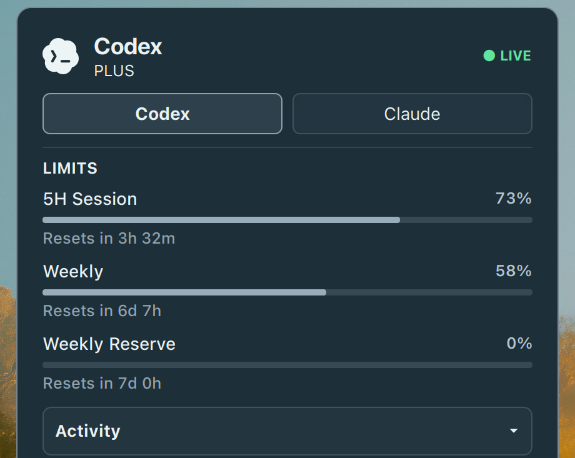
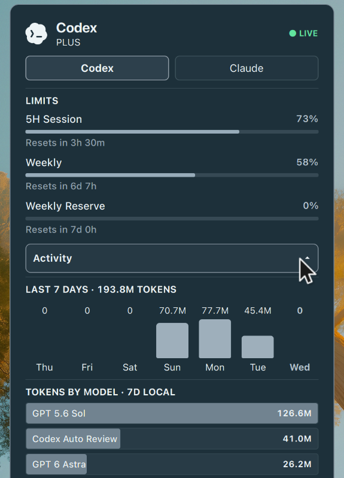

# UsageBeam

UsageBeam puts Codex and Claude Code usage where it is easiest to see: in the
GNOME top panel. The compact indicator shows the active provider's shortest quota
and reset countdown; its popup reveals every reported limit plus seven days of
local token and model activity.

The product concept was adapted for GNOME Shell from the
[Agents plugin in Omarchy](https://github.com/omacom/omarchy/blob/quattro/shell/plugins/agents/README.md).
UsageBeam is an independent implementation designed around GNOME's native panel,
preferences, accessibility, and lifecycle conventions.

## At a glance

- Live account limits and reset windows for Codex and Claude Code.
- A stable, single-provider panel indicator.
- Four panel placements: left area, right area, left of calendar, or right of
  calendar.
- Seven-day local activity chart and per-model token totals.
- Independent live, local, cached, syncing, and setup states.
- Light and dark surfaces derived from the active GNOME accent color.
- Private local storage with no prompt, response, transcript, or credential
  retention.

UsageBeam displays only data reported by a provider or found in local usage
records. Local activity covers this device; it is not billing data and is never
converted into an account quota.

## Screenshots

### Panel indicator


### Account limits



### Local activity



### Preferences

_Screenshot placeholder — provider, placement, refresh, and notification settings._

## Supported providers

### Codex

UsageBeam reads account quota windows through the installed Codex CLI app-server
and scans local Codex session records for activity. The CLI must be installed
and signed in to show live limits. Common user-local, fnm, nvm, mise, asdf, and
Volta installations are discovered even when GNOME Shell has a restricted
`PATH`.

### Claude Code

UsageBeam reads supported account limits from Claude Code's saved OAuth sign-in
and scans local Claude Code project records for activity. Account limits require
an active sign-in; local activity can remain available independently.

See the detailed [Codex](docs/providers/codex.md) and
[Claude Code](docs/providers/claude.md) provider notes for source and
compatibility details.

## Requirements

- GNOME Shell 50.
- GJS with Gio, GLib, and Soup 3 introspection data.
- The Codex CLI and/or Claude Code, installed and signed in for account limits.

## Install

Download the UsageBeam ZIP from [GitHub Releases](https://github.com/oo7kc/freeby/releases),
then run:

```bash
gnome-extensions install ./usagebeam@oo7kc.github.io-VERSION.zip
gnome-extensions enable usagebeam@oo7kc.github.io
```

Log out and back in when installing UsageBeam for the first time so GNOME Shell
can discover the new extension identity. When replacing an existing UsageBeam
installation, add `--force`; it tells `gnome-extensions` that overwriting the
installed copy is intentional.

## Settings

Open the preferences window from the popup or with:

```bash
gnome-extensions prefs usagebeam@oo7kc.github.io
```

Preferences control panel placement, refresh frequency, and quota notifications.

## Privacy and storage

UsageBeam processes provider data locally and stores only derived usage metadata:

- State: `$XDG_STATE_HOME/usagebeam`
- Incremental history cache: `$XDG_CACHE_HOME/usagebeam`

Files are created with private permissions. Credentials are read only when a
provider requires them and are never copied, cached, or logged. Account and
session identifiers used for change detection or deduplication are hashed before
persistence. Prompt and response content is ignored.

Recognized settings and derived data from older Freeby alpha builds are migrated
once without overwriting existing UsageBeam data. Credentials are excluded from
that migration.

## Troubleshooting

- **Limits show Setup:** open the provider's CLI and confirm it is signed in.
- **Activity is local only:** this is expected; UsageBeam does not merge records
  from other devices.
- **Values show Cached:** the last valid values remain visible during a temporary
  provider or network failure.
- **The indicator is absent after installation:** log out and back in, then enable
  the extension again.
- **Another panel extension changes placement:** UsageBeam follows GNOME's panel
  boxes, so layout extensions may override the final arrangement.

## Remove

```bash
gnome-extensions disable usagebeam@oo7kc.github.io
gnome-extensions uninstall usagebeam@oo7kc.github.io
```

UsageBeam is licensed under the [MIT License](LICENSE).
